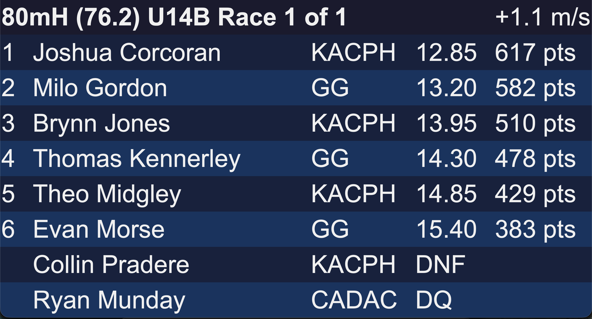
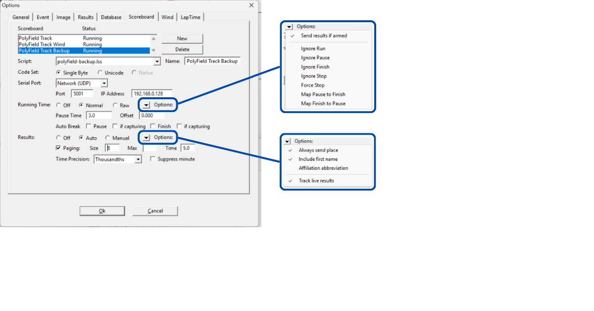

# PolyField Track

Un software de visualización y presentación de resultados para los sistemas de foto-finish FinishLynx y TimeTronics. Funciona en Windows y Mac como una aplicación de escritorio vinculada a su carpeta de resultados de foto-finish.

[Descargar desde polyfield.co.uk](https://www.polyfield.co.uk)

  <a class="manual-btn" href="https://kingstonpolyac.github.io/PolyField-Server/">
    Manual de PolyField Server →
  </a>

* Contenido
{:toc}

## Descripción general

PolyField Track convierte sus resultados de FinishLynx o TimeTronics en pantallas en directo por todo su recinto. Una sola instancia de escritorio vigila su carpeta de resultados y sirve una interfaz web que cualquier dispositivo de la red puede abrir — marcadores, un quiosco de autoservicio para atletas, un panel de velocidades y mucho más.

El software mantiene al **operador al mando**: los resultados solo aparecen una vez guardados, garantizando una validación positiva antes de mostrarlos. Se admiten guardados múltiples — así puede mostrar pronto a los atletas de fondo, o revelar una carrera una vez asignadas las marcas de los tres primeros.

## Cómo funciona

- Ejecuta **una sola instancia** de la aplicación de escritorio en un ordenador conectado a su carpeta de resultados de foto-finish.
- La aplicación crea una interfaz web en el **puerto 3000**. Cualquier dispositivo de la misma red la abre en un navegador — sin necesidad de instalar nada en las pantallas.
- Cada pantalla se registra a sí misma y se le puede asignar un diseño para mostrar. El número de pantallas solo está limitado por su red y el ordenador anfitrión.
- El operador controla lo que aparece — resultados, superposiciones (texto, salvapantallas, cuenta atrás, récords, vista de línea) o un diseño personalizado completo.

## Primeros pasos

### 1. Definir la carpeta de resultados

Es la carpeta donde FinishLynx o TimeTronics guarda los resultados (LIF, etc.). Haga clic en el botón rojo de la esquina superior derecha, **«Seleccionar carpeta de resultados»**. Podrá cambiarla más tarde con **«Cambiar carpeta»**.

Una vez definida, la interfaz web se crea y la dirección de acceso se muestra en la parte superior de la aplicación de escritorio (p. ej. `http://track.local:3000` o `http://<su-IP>:3000`).

### 2. Abrir una pantalla

En cada dispositivo de pantalla, abra un navegador y vaya a la dirección indicada, luego `/display`. Cada pantalla que se conecta recibe un número automáticamente. Consulte [Conexión de pantallas](#connecting-screens) para el atajo por código QR.

> **Consejo** — deje la aplicación de escritorio en su pantalla de inicio y controle las pantallas desde ahí, o desde un segundo dispositivo a través de la interfaz web. Así mantiene el control de las superposiciones mientras los resultados fluyen automáticamente.

## El panel de control de escritorio

El panel de control es el puesto del operador. En la parte superior se define la carpeta de resultados y se ve la dirección de conexión. Los controles principales se agrupan en una fila de botones compacta (que pasa a una segunda fila en ventanas estrechas):

| Control | Qué hace |
|---|---|
| **Texto y salvapantallas** | Escribir un mensaje para mostrar en todas las pantallas, o vincular una imagen. Ideal para mensajes de patrocinadores, «reunión suspendida», etc. |
| **Salvapantallas** | Mostrar una **imagen** vinculada o un **diseño guardado** en el área del salvapantallas. Si ya hay una fuente definida, una pulsación lo activa/desactiva; el botón ⚙ vuelve a abrir las opciones. |
| **Vista de línea** | Enviar la última imagen de foto-finish a las pantallas. Atenuado hasta que aparezcan imágenes JPG de foto-finish en la carpeta de resultados. |
| **Reloj** | Mostrar el reloj en marcha a pantalla completa en las pantallas con un widget de reloj. |
| **Récords** | Mostrar tarjetas de celebración para los atletas marcados con un récord. Ant. / Sig. recorren los atletas marcados o la selección manual. |
| **Cuenta atrás** | Cuenta atrás hasta una hora objetivo. Introduzca la hora e Iniciar; se oculta a cero. |
| **Constructor de diseños** | Abrir el diseñador de diseños (véase más abajo). |
| **Explorar LIF** | Volver a mostrar cualquier resultado anterior de la carpeta supervisada. |

## Superposiciones

Las superposiciones son lo que se muestra **encima** (o en lugar) de los resultados: texto, salvapantallas, vista de línea, reloj, récords y cuenta atrás. Tres puntos importantes sobre su funcionamiento:

- **Puede activar varias a la vez.** Por ejemplo un fondo de salvapantallas con una cuenta atrás y un banner de texto encima. Activar una ya no desactiva las demás.
- **Los widgets deciden qué se muestra y dónde.** Cada pantalla solo muestra las superposiciones que contiene su diseño asignado — así, distintas pantallas pueden mostrar distintas combinaciones desde un solo escritorio.
- **Un nuevo resultado las borra todas** y devuelve cada pantalla a los resultados — de modo que los resultados en directo siempre tienen prioridad.

### Salvapantallas (imagen o diseño)

Elija **Imagen** (una imagen vinculada — paneles de patrocinadores, avisos) o **Diseño** (cualquier diseño guardado mostrado como toma total del área del salvapantallas). Seleccione la fuente y pulse **Mostrar**. Una vez definida una fuente, el botón Salvapantallas la activa directamente.

### Cuenta atrás

Cuenta atrás hasta una **hora objetivo**, leída del reloj propio de cada pantalla. Introduzca la hora (p. ej. 15:40) e Iniciar. En el Constructor de diseños puede definir el rótulo (por defecto «Next Event In:»), si se muestran los segundos, y el texto, la fuente y el color. Se oculta a cero y cede el paso a los nuevos resultados y a otras superposiciones.

### Récords

Marque el récord de un atleta en FinishLynx (véase [configuración](#finishlynx-setup)), luego pulse **Récords** para mostrar una tarjeta de celebración — atleta, categoría, prueba, club y marca. Ant. / Sig. recorren varios atletas marcados.
También es posible la selección manual de un atleta desde un archivo LIF existente y marcarlo como récord. Pulse **Récords** y luego **Selección manual** para iniciar el proceso de 3 pasos. 1. Elegir la carrera. 2. Elegir la marca. 3. Elegir o introducir el tipo de récord.

### Vista de línea

Envía la última imagen de foto-finish a las pantallas con un widget de vista de línea. El control Rotación (s) define cada cuánto alterna la foto con el resultado.

## Tamaño del texto y modos de rotación

El tamaño del texto de resultados por defecto se ajusta con los botones **+** y **−** (los widgets de diseño tienen su propio Tamaño del texto en el Constructor de diseños).

El modo de rotación determina cómo se muestran los resultados con más de 8 competidores:

| Modo | Comportamiento |
|---|---|
| **Desplazar** | Las 3 primeras filas quedan fijas; las filas 4+ se desplazan por los demás competidores. |
| **Página** | Pagina: 1–8, luego 9–16, etc. en la rotación. |
| **Desplazar todo** | Las 8 filas se desplazan por los competidores sin posiciones fijas. |

La velocidad de rotación de atletas por defecto es de **5 segundos**.

## Explorar y restaurar

**Explorar LIF** lista los resultados anteriores de la carpeta supervisada para volver a mostrar cualquiera de ellos — útil para sesiones fotográficas o para volver a mostrar una serie anterior. Abrir un archivo antiguo en FinishLynx *no* altera la pantalla en directo; solo un cambio real de un resultado lo promueve.

## Conexión de pantallas {#connecting-screens}

Abra `http://<dirección>:3000/display` en cada pantalla; se le asigna un número automáticamente. La página **Códigos QR de pantallas** (desde el panel Pantallas, o `/screens-overview`) muestra un código escaneable para cada página de pantalla, para dirigir rápidamente un teléfono, una tableta o el navegador de un televisor a la página correcta.

En el panel **Pantallas** asigna un diseño guardado a cada pantalla de forma independiente y elimina las pantallas que ya no están activas. El escritorio también tiene una vista previa de marcador integrada que refleja una pantalla real cuando le asigna un diseño.

## El Constructor de diseños

Abra el Constructor de diseños para diseñar marcadores personalizados a partir de widgets. Cada diseño tiene una relación de aspecto y un tema, y se construye soltando widgets en una cuadrícula y colocándolos.

- **Añada widgets** desde la paleta de la izquierda, agrupados por Prueba actual, Resultados, Superposiciones e Información.
- **Seleccione un widget** para editar sus **Propiedades** a la derecha — posición y tamaño, columnas, tamaño del texto, fuente, colores y opciones propias del widget.
- **Widgets superpuestos:** use el navegador **◀ Widgets ▶** en la parte superior del panel Propiedades para recorrer la selección de cada widget, incluidos los ocultos tras otros.
- **Asigne** un diseño a una pantalla (o a la vista previa del marcador) desde el panel Pantallas.

## Referencia de widgets

| Widget | Muestra |
|---|---|
| Tabla de resultados | El resultado actual, con columnas, rotación y tamaño de texto configurables. |
| Multi-resultado | Una cuadrícula de varios resultados (2×2 / 3×2), el más reciente o en rotación. |
| Lista de salida | La lista de salida de la prueba actual. |
| Reloj en marcha / Tiempo detenido | Reloj en directo o congelado. |
| Nombre de prueba / Viento | Nombre y viento de la prueba actual o del resultado. |
| Texto personalizado / Logo / Hora del día | Texto estático, una imagen/logo, o la hora. |
| Resultados RAZA / Concursos | Puntos WPA de para-atletismo, y resultados de concursos PolyField. |
| Superposiciones Texto / Salvapantallas / Vista de línea / Reloj | El banner de texto, la imagen/diseño del salvapantallas, la foto-finish y el reloj a pantalla completa (se muestran cuando el operador activa la superposición correspondiente). |
| Superposición de Récord | Tarjetas de celebración de récords (elementos posicionables por arrastre, tamaño por elemento). |
| Superposición de Cuenta atrás | Cuenta atrás hasta una hora objetivo con un rótulo editable. |

## Puntos de pruebas combinadas

Para una competición de pruebas combinadas, la tabla de resultados puede mostrar una columna adicional **Combined Event** (prueba combinada) que puntúa cada marca de pista según las **tablas oficiales 2026 UKA/ESAA de pruebas combinadas**.

- **Añadir la columna** — en el Constructor de diseños, seleccione un widget **Tabla de resultados** o **Multi-resultado** y añada la columna **Combined Event** (Propiedades → Columnas). Marque **Añadir «pts» a la columna de puntos de pruebas combinadas** para mostrar `617 pts` en lugar de `617`.
- **Automático por prueba y sexo** — la tabla se elige a partir del nombre de la prueba (p. ej. `80mH (76.2) U14B`), cubriendo todas las categorías — de U13 a U20, Senior y Máster — sin configuración por atleta.
- **Solo pista** — se puntúan las vallas y las carreras lisas; los concursos, los relevos y cualquier prueba sin tabla correspondiente quedan en blanco.
- **No finalizados** — los atletas DNS no se muestran; DNF y DQ no muestran puntuación.

El tiempo usado para la búsqueda es el valor mostrado (ya redondeado a la precisión del cronometraje), por lo que los puntos coinciden exactamente con las tablas oficiales.

## Temas, dorsales y abreviaturas de clubes

Los **temas** definen los colores por defecto de todas las pantallas; puede crearlos, duplicarlos y editarlos. Los **dorsales** se pueden mostrar u ocultar en la vista de resultados. Las **abreviaturas de clubes** se gestionan de forma centralizada (edite la lista de clubes) y se aplican en todas partes — añada un club nuevo o sustituya una abreviatura integrada, y los cambios llegan a todas las pantallas en unos segundos.

## Vistas web

Las vistas web se acceden mejor a través de la interfaz web, usando los datos de acceso de la parte superior de la aplicación de escritorio. Páginas clave:

| Página | URL |
|---|---|
| Marcador (diseño activado) | `/scoreboard` |
| Pantalla de visualización | `/display` |
| Vista multi-resultado | `/results` |
| Quiosco de atleta | `/athlete` |
| Panel de velocidades | `/speed` |
| Reloj en marcha | `/clock` |
| Clasificaciones RAZA | `/raza` |
| Códigos QR de pantallas | `/screens-overview` |

### Vista multi-resultado

Muestra los resultados en una matriz 2×2 o 3×2. Configúrela para mostrar los últimos resultados o rotar por todos los resultados disponibles; adapte el tamaño del texto; y use el modo de pantalla completa para ocultar la barra de herramientas (cualquier movimiento del ratón la hace reaparecer). Los resultados se paginan, con la página actual indicada arriba. El icono de búsqueda abre el quiosco de atleta.

### Quiosco de atleta (autoservicio)

Abra `<DIRECCIÓN-IP>:3000/athlete`. Un atleta busca por nombre o número de dorsal; al hacer clic en un nombre se muestran todas sus marcas en la carpeta de resultados actual. Al hacer clic en una tarjeta de resultado se muestra a pantalla completa para sesiones fotográficas. **Restablecer** borra la búsqueda; el botón atrás vuelve al campo de búsqueda.

## Configuración de FinishLynx y TimeTronics {#finishlynx-setup}

- **Scripts de marcador** — use los scripts suministrados `polyfield.lss`, `polyfield-wind.lss` y `polyfield-backup.lss` para que FinishLynx envíe el reloj en marcha, el viento, las listas de salida y los resultados a PolyField Track. Consulte **[Configuración de los marcadores](#scoreboard-setup)** más abajo para configurar cada salida.
- **Récords** — marque el récord de un atleta en el campo **User 3** de FinishLynx (p. ej. `PB` o `W50 WR`). Los códigos de récord se amplían a títulos completos a partir de la lista de clubes.
- **Vista de línea** — exporte sus imágenes de foto-finish (JPG) a la carpeta de resultados supervisada; el botón Vista de línea se activa en cuanto aparecen.
- **Resultados** — guarde su LIF con normalidad; PolyField solo muestra los resultados guardados.

### Configuración de los marcadores (FinishLynx) {#scoreboard-setup}

PolyField Track recibe el reloj en marcha, las listas de salida, los resultados en directo y el viento por una única transmisión UDP en el **puerto 5001**. FinishLynx los envía a través de sus salidas de **Scoreboard** (**Options → Scoreboard**). Configure las salidas siguientes — cada una es un marcador de **Red (UDP)** dirigido al ordenador que ejecuta PolyField Track.

**Ajustes comunes a todas las salidas:**

| Ajuste | Valor |
|---|---|
| Serial Port | Network (UDP) |
| Port | `5001` |
| IP Address | la IP del ordenador que ejecuta PolyField Track |
| Code Set | Single Byte |
| Results | Auto · Paging activado |

#### 1. Salida principal — `polyfield.lss`

La transmisión principal: reloj en marcha, listas de salida y resultados en directo.

- **Script:** `polyfield.lss` · **Name:** PolyField Track
- **Running Time:** Normal
- **Running Time → Options:** *Send results if armed* ✓
- **Auto Break:** *Finish* ✓ (con *if capturing* ✓)
- **Results → Options:** *Always send place* ✓ · *Include first name* ✓ · *Track live results* ✓ (deje *Affiliation abbreviation* desactivado — PolyField Track expande los nombres de los clubes desde su propia lista de clubes)

#### 2. Salida de viento — `polyfield-wind.lss`

Una salida dedicada a las lecturas de viento.

- **Script:** `polyfield-wind.lss` · **Name:** PolyField Track Wind
- **Running Time:** **Raw** — el viento se dispara en cada corte de célula; el modo Raw transmite cada lectura tal cual (PolyField Track ignora los valores «no data»)
- **Running Time → Options:** *Send results if armed* desactivado
- **Results → Options:** *Always send place* ✓ · *Include first name* ✓ · *Affiliation abbreviation* ✓ · *Track live results* ✓

#### 3. Salida de respaldo — `polyfield-backup.lss` (recomendado)

Una segunda copia independiente de la **lista de salida** para mayor fiabilidad. FinishLynx envía cada lista de salida solo una vez al cargar la prueba, por lo que un único paquete UDP perdido puede dejar una pantalla en blanco. Esta salida de respaldo envía una lista de salida idéntica desde un marcador distinto: si se pierde un paquete, el otro llega igualmente. Diríjala al **mismo** ordenador PolyField Track.

- **Script:** `polyfield-backup.lss` · **Name:** PolyField Track Backup
- **Running Time:** Normal
- **Running Time → Options:** *Send results if armed* ✓
- **Results → Options:** *Always send place* ✓ · *Include first name* ✓ · *Track live results* ✓

> Las tres salidas pueden funcionar a la vez y enviar a la misma IP y puerto — PolyField Track las distingue por su contenido.

## Red

- La aplicación se sirve en el **puerto 3000** y se anuncia como `track.local` en la red, de modo que las pantallas pueden usar `http://track.local:3000` sin conocer la IP.
- En ordenadores con más de una tarjeta de red (habitual en Windows), elija el adaptador de red correcto en el panel de conexión para que se anuncie la dirección correcta.
- Todos los dispositivos deben estar en la misma red que el ordenador anfitrión.

## Resolución de problemas

| Síntoma | Comprobar |
|---|---|
| El botón Vista de línea está atenuado | Aún no hay imágenes JPG de foto-finish en la carpeta supervisada — compruebe la ruta de exportación de imágenes de FinishLynx. |
| Récords no muestra nada | El atleta debe estar marcado en FinishLynx User 3 o mediante selección manual, y el diseño debe contener un widget Superposición de Récord. |
| Una pantalla muestra «esperando diseño» | Asigne un diseño a esa pantalla en el panel Pantallas. |
| Reapareció un resultado antiguo | Abrir un archivo en FinishLynx ya no lo promueve; solo lo hace un cambio real. Use Explorar LIF para volver a mostrar resultados anteriores de forma intencionada. |
| Las pantallas no se conectan | Confirme la misma red, el puerto 3000 accesible y (PC con varias tarjetas) el adaptador de red correcto seleccionado. |

## Descarga y soporte

Descargue la última versión desde [www.polyfield.co.uk](https://www.polyfield.co.uk) o desde la [página de versiones](https://github.com/KingstonPolyAC/PolyField-Track/releases). Soporte: [support@polyfield.co.uk](mailto:support@polyfield.co.uk).
