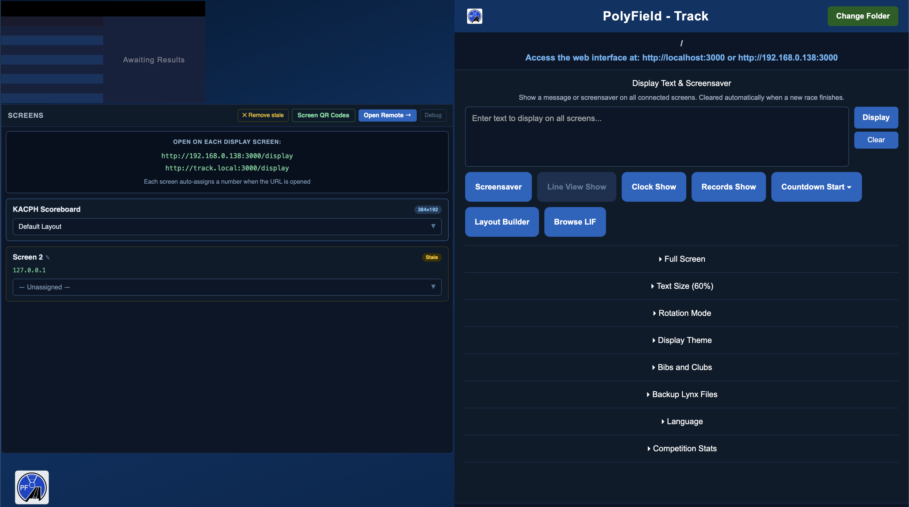
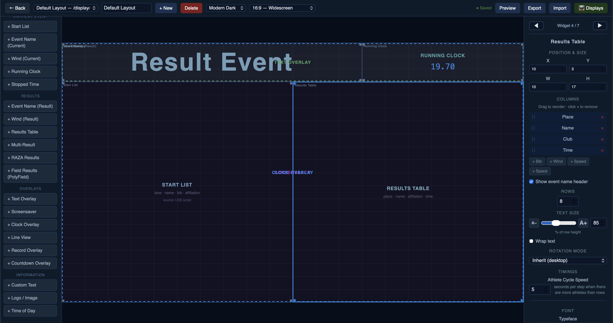
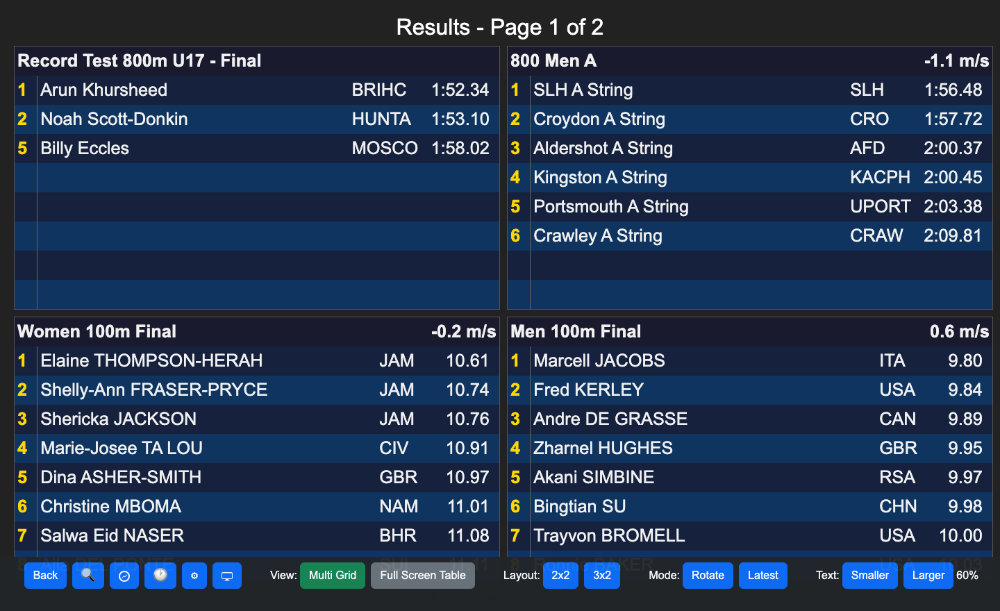
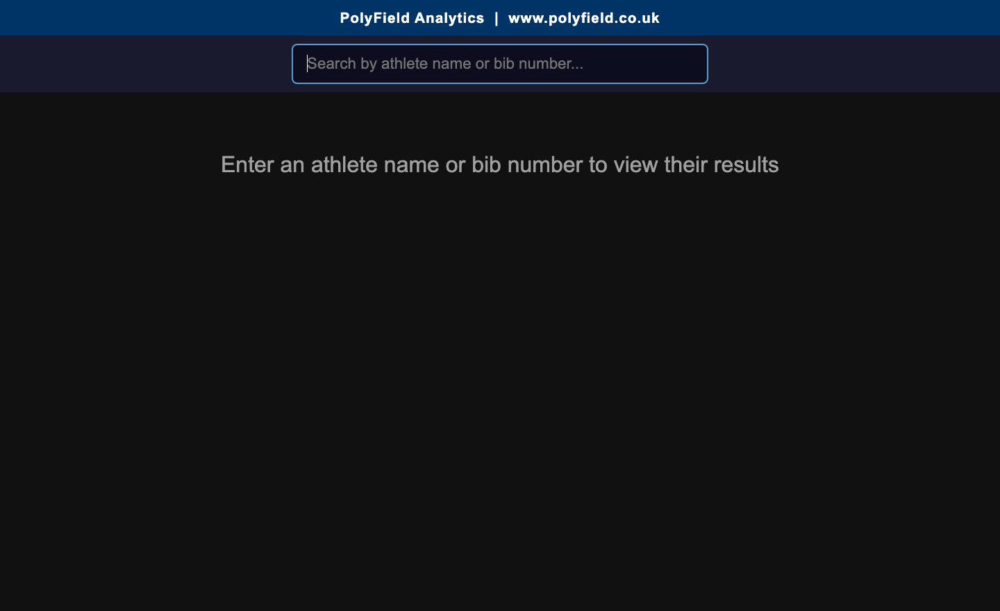

# PolyField Track

A results viewing and display software package for FinishLynx and TimeTronics photo-finish systems. Runs on Windows and Mac as a desktop device linked to your photo-finish results folder.

[Download from polyfield.co.uk](https://www.polyfield.co.uk)

* Contents
{:toc}

## Overview

PolyField Track turns your FinishLynx or TimeTronics results into live displays across your venue. One desktop instance watches your results folder and serves a web interface that any device on the network can open — scoreboards, an athlete self-service kiosk, a speed board, and more.

It keeps the **operator in control**: results only appear once they are saved, ensuring positive validation before display. Multiple saves are supported — so you can show distance-race athletes early, or reveal a race once the top 3 have performances assigned.

## How it works

- You run **one instance** of the desktop app on a computer connected to your photo-finish results folder.
- The app builds a web interface on **port 3000**. Any device on the same network opens it in a browser — no install needed on the displays.
- Each display registers itself and can be given a layout to show. The number of displays is limited only by your network and the host computer.
- The operator drives what appears — results, overlays (text, screensaver, countdown, records, line view), or a full custom layout.

## Getting started

### 1. Set the results directory

This is the folder FinishLynx or TimeTronics saves results into (LIF, etc.). Click the red button in the top-right corner, **“Select Results Folder”**. You can change it later with **“Change Folder”**.

Once set, the web interface builds and the access address is shown at the top of the desktop app (e.g. `http://track.local:3000` or `http://<your-IP>:3000`).

### 2. Open a display

On each display device, open a browser and go to the address shown, then `/display`. Each screen that connects auto-assigns a number. See [Connecting screens](#connecting-screens) for the QR-code shortcut.

> **Tip** — leave the desktop app on its home screen and drive the displays from there, or from a second device on the web interface. This keeps you in control of the overlays while the results flow automatically.

## The desktop control panel

The control panel is the operator's home. Along the top you set the results folder and see the connection address. The main controls are grouped into a compact button row (which wraps to a second row on narrow windows):

| Control | What it does |
|---|---|
| **Text & screensaver** | Type a message to show on all screens, or link a graphic. Great for sponsor messages, “meet suspended”, etc. |
| **Screensaver** | Show a linked **image** or a chosen **saved layout** across the screensaver area. If a source is already set, one press toggles it on/off; the ⚙ button re-opens the options. |
| **Line View** | Push the latest photo-finish image to the displays. Greyed out until photo-finish JPGs appear in the results folder. |
| **Clock** | Show the running clock full-screen on screens with a clock widget. |
| **Records** | Show celebratory record cards for athletes flagged with a record. Prev / Next step through the flagged athletes. |
| **Countdown** | Count down to a target time of day. Enter the time and Start; it hides itself at zero. |
| **Layout Builder** | Open the layout designer (see below). |
| **Browse LIF** | Re-show any previous result from the monitored folder. |

## Overlays

Overlays are things you show **on top of** (or instead of) the results: text, screensaver, line view, clock, records and countdown. Three important points about how they work:

- **You can run several at once.** For example a screensaver background with a countdown and a text banner on top. Turning one on no longer turns the others off.
- **The widgets decide what shows where.** Each display only shows the overlays that its assigned layout contains — so different screens can show different combinations from one desktop.
- **A new result clears them all** and returns every screen to the results — so live results always take priority.

### Screensaver (image or layout)

Choose **Image** (a linked graphic — sponsor boards, notices) or **Layout** (any saved layout shown as a full takeover of the screensaver area). Pick the source, then press **Display**. Once a source is set, the Screensaver button toggles it directly.

### Countdown

Counts down to a **target time of day**, read from each screen's own clock. Enter the time (e.g. 15:40) and Start. In the Layout Builder you can set the caption (default “Next Event In:”), whether seconds are shown, and the text/font/colour. It hides itself at zero and yields to new results and other overlays.

### Records

Flag an athlete's record in FinishLynx (see [setup](#finishlynx--timetronics-setup)), then press **Records** to show a celebratory card — athlete, category, event, club and time. Prev / Next step through multiple flagged athletes.

### Line view

Sends the latest photo-finish image to displays with a line-view widget. The Rotation (s) control sets how often it alternates the photo with the result.

## Text size & rotation modes

The default results text size is adjusted with the **+** and **−** buttons (layout widgets have their own Text Size in the Layout Builder).

The rotation mode determines how results with more than 8 competitors display:

| Mode | Behaviour |
|---|---|
| **Scroll** | Top 3 rows locked; rows 4+ scroll through the remaining competitors. |
| **Page** | Paginates: 1–8, then 9–16, etc. on rotation. |
| **Scroll All** | All 8 rows scroll through the competitors with no locked positions. |

The default athlete rotation speed is **5 seconds**.

## Browse & restore

**Browse LIF** lists previous results from the monitored folder so you can re-show any of them — useful for photo opportunities or re-displaying an earlier heat. Opening an old file in FinishLynx does *not* disturb the live display; only a genuine change to a result promotes it.

## Connecting screens

Open `http://<address>:3000/display` on each screen; it auto-assigns a number. The **Screen QR Codes** page (from the Screens panel, or `/screens-overview`) shows a scannable code for every display page, so you can point a phone, tablet or TV browser at the right page quickly.

In the **Screens** panel you assign a saved layout to each screen independently, and remove screens that are no longer live. The desktop also has a built-in scoreboard preview that mirrors a real screen when you assign it a layout.

## The Layout Builder

Open the Layout Builder to design custom scoreboard layouts from widgets. Each layout has an aspect ratio and a theme, and is built by dropping widgets onto a grid and positioning them.

- **Add widgets** from the palette on the left, grouped by Current Event, Results, Overlays and Information.
- **Select a widget** to edit its **Properties** on the right — position & size, columns, text size, font, colours and per-widget options.
- **Overlapping widgets:** use the **◀ Widgets ▶** navigator at the top of the Properties panel to cycle selection through every widget, including ones hidden behind others.
- **Assign** a layout to a screen (or the scoreboard preview) from the Screens panel.

## Widget reference

| Widget | Shows |
|---|---|
| Results Table | The current result, with configurable columns, rotation and text size. |
| Multi-Result | A grid of several results (2×2 / 3×2), latest or rotating. |
| Start List | The start list for the current event. |
| Running Clock / Stopped Time | Live or frozen clock. |
| Event Name / Wind | Current or result event name and wind. |
| Custom Text / Logo / Time of Day | Static text, an image/logo, or the time. |
| RAZA / Field Results | Para-athletics WPA points, and PolyField field-event results. |
| Text / Screensaver / Line View / Clock overlays | The text banner, screensaver image/layout, photo finish, and full-screen clock (shown when the operator triggers the matching overlay). |
| Record Overlay | Celebratory record cards (drag-positioned elements, per-element size). |
| Countdown Overlay | Countdown to a target time with an editable caption. |

## Themes, bibs & club abbreviations

**Themes** set the default colours for all displays; you can create, duplicate and edit them. **Bibs** can be shown or hidden in the results view. **Club abbreviations** are managed centrally (edit the club list) and applied everywhere — add a new club or override a built-in abbreviation, and changes reach all displays within a few seconds.

## Web views

The web views are best accessed through the web interface, using the access details at the top of the desktop app. Key pages:

| Page | URL |
|---|---|
| Scoreboard (activated layout) | `/scoreboard` |
| Display screen | `/display` |
| Multi-Result view | `/results` |
| Athlete kiosk | `/athlete` |
| Speed board | `/speed` |
| Running clock | `/clock` |
| RAZA rankings | `/raza` |
| Screen QR codes | `/screens-overview` |

### Multi-Result view

Displays results in a 2×2 or 3×2 matrix. Configure it to show the latest results or rotate through all available results; adapt the text size; and use full-screen mode to hide the toolbar (any mouse movement pops it back up). Results paginate, with the current page shown at the top. The search icon opens the athlete kiosk.

### Athlete kiosk (self-service)

Open `<IP-ADDRESS>:3000/athlete`. An athlete searches by name or bib number; clicking a name shows all their performances in the current results directory. Clicking a result card displays it full-screen for photo opportunities. **Reset** clears the search; the back button returns to the search field.

## FinishLynx & TimeTronics setup

- **Scoreboard scripts** — use the supplied `polyfield.lss` (and `polyfield-wind.lss`) scripts so FinishLynx sends the live running clock and wind to PolyField Track.
- **Records** — flag an athlete's record in the FinishLynx **User 3** field (e.g. `PB` or `W50 WR`). Record codes are expanded to full titles from the club list.
- **Line view** — export your photo-finish images (JPG) into the monitored results folder; the Line View button enables once they appear.
- **Results** — save your LIF as normal; PolyField only displays saved results.

## Networking

- The app serves on **port 3000** and advertises itself as `track.local` on the network, so displays can use `http://track.local:3000` without knowing the IP.
- On computers with more than one network card (common on Windows), pick the correct network adapter in the connection panel so the right address is advertised.
- All devices must be on the same network as the host computer.

## Troubleshooting

| Symptom | Check |
|---|---|
| Line View button is greyed out | No photo-finish JPGs in the monitored folder yet — check your FinishLynx image export path. |
| Records shows nothing | The athlete must be flagged in FinishLynx User 3, and the layout must contain a Record Overlay widget. |
| A display shows “waiting for layout” | Assign a layout to that screen in the Screens panel. |
| An old result reappeared | Opening a file in FinishLynx no longer promotes it; only a real change does. Use Browse LIF to re-show past results intentionally. |
| Displays can't connect | Confirm the same network, port 3000 reachable, and (multi-card PCs) the right network adapter selected. |

## Download & support

Download the latest version from [www.polyfield.co.uk](https://www.polyfield.co.uk) or the [releases page](https://github.com/KingstonPolyAC/PolyField-Track/releases). Support: [support@polyfield.co.uk](mailto:support@polyfield.co.uk).
