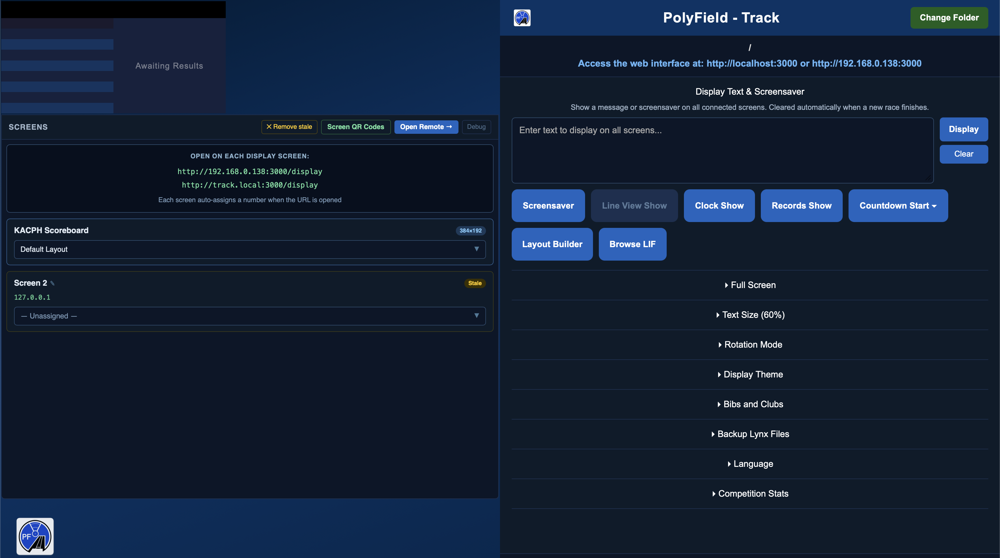
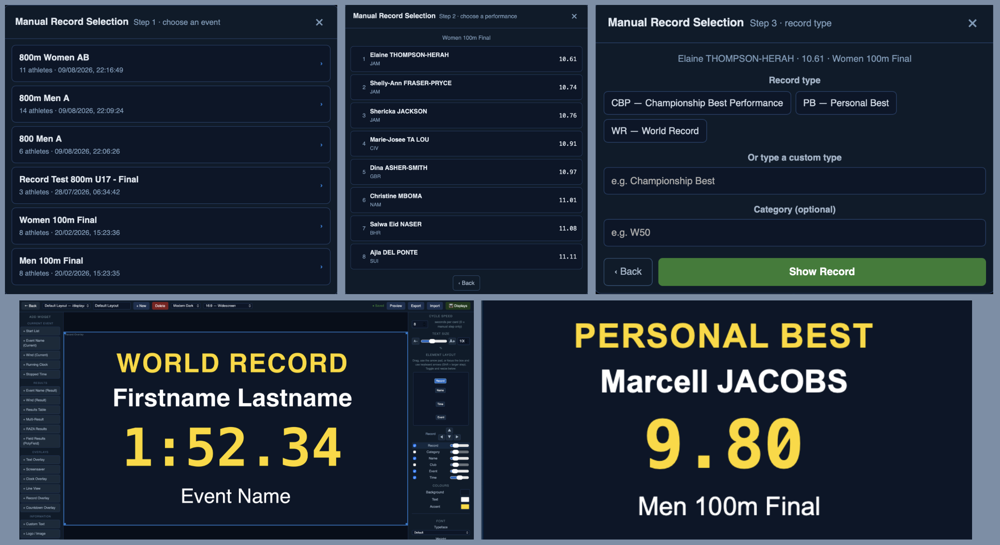
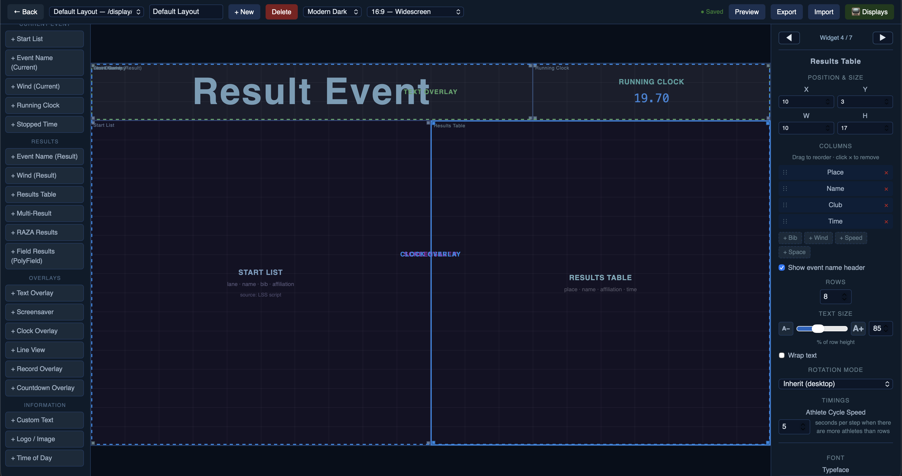
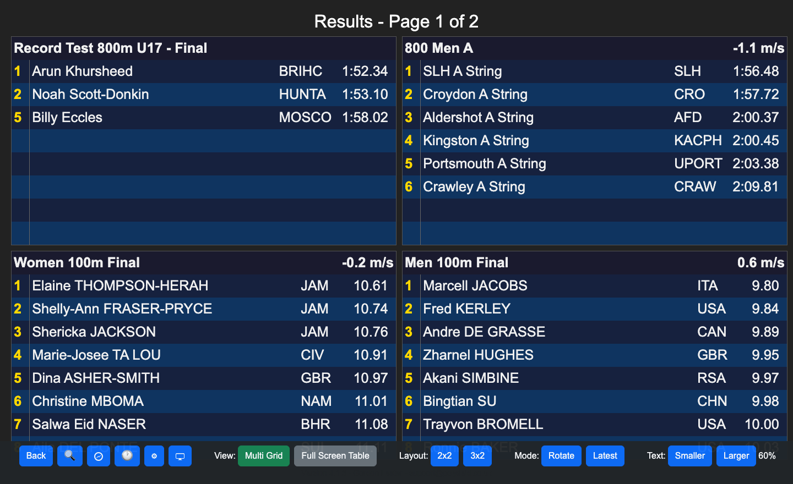
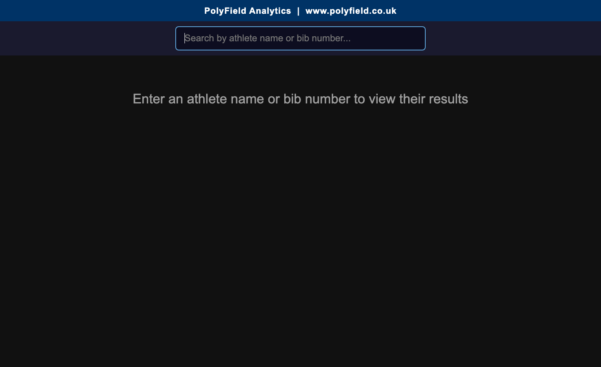

# PolyField Track

A results viewing and display software package for FinishLynx and TimeTronics photo-finish systems. Runs on Windows and Mac as a desktop device linked to your photo-finish results folder.

[Download from polyfield.co.uk](https://www.polyfield.co.uk)

* Contents
{:toc}

## Overview

PolyField Track turns your FinishLynx or TimeTronics results into live displays across your venue. One desktop instance watches your results folder and serves a web interface that any device on the network can open — scoreboards, an athlete self-service kiosk, a speed board, and more.

It keeps the **operator in control**: results only appear once they are saved, ensuring positive validation before display. Multiple saves are supported — so you can show distance-race athletes early, or reveal a race once the top 3 have performances assigned.

## How it works

- You run **one instance** of the desktop app on a computer connected to your photo-finish results folder.
- The app builds a web interface on **port 3000**. Any device on the same network opens it in a browser — no install needed on the displays.
- Each display registers itself and can be given a layout to show. The number of displays is limited only by your network and the host computer.
- The operator drives what appears — results, overlays (text, screensaver, countdown, records, line view), or a full custom layout.

## Getting started

### 1. Set the results directory

This is the folder FinishLynx or TimeTronics saves results into (LIF, etc.). Click the red button in the top-right corner, **“Select Results Folder”**. You can change it later with **“Change Folder”**.



Once set, the web interface builds and the access address is shown at the top of the desktop app (e.g. `http://track.local:3000` or `http://<your-IP>:3000`).

### 2. Open a display

On each display device, open a browser and go to the address shown, then `/display`. Each screen that connects auto-assigns a number. See [Connecting screens](#connecting-screens) for the QR-code shortcut.

> **Tip** — leave the desktop app on its home screen and drive the displays from there, or from a second device on the web interface. This keeps you in control of the overlays while the results flow automatically.

## The desktop control panel

The control panel is the operator's home. Along the top you set the results folder and see the connection address. The main controls are grouped into a compact button row (which wraps to a second row on narrow windows):

| Control | What it does |
|---|---|
| **Text & screensaver** | Type a message to show on all screens, or link a graphic. Great for sponsor messages, “meet suspended”, etc. |
| **Screensaver** | Show a linked **image** or a chosen **saved layout** across the screensaver area. If a source is already set, one press toggles it on/off; the ⚙ button re-opens the options. |
| **Line View** | Push the latest photo-finish image to the displays. Greyed out until photo-finish JPGs appear in the results folder. |
| **Clock** | Show the running clock full-screen on screens with a clock widget. |
| **Records** | Show celebratory record cards for athletes flagged with a record. Prev / Next step through the flagged athletes or manual selection. |
| **Countdown** | Count down to a target time of day. Enter the time and Start; it hides itself at zero. |
| **Layout Builder** | Open the layout designer (see below). |
| **Browse LIF** | Re-show any previous result from the monitored folder. |

## Overlays

Overlays are things you show **on top of** (or instead of) the results: text, screensaver, line view, clock, records and countdown. Three important points about how they work:

- **You can run several at once.** For example a screensaver background with a countdown and a text banner on top. Turning one on no longer turns the others off.
- **The widgets decide what shows where.** Each display only shows the overlays that its assigned layout contains — so different screens can show different combinations from one desktop.
- **A new result clears them all** and returns every screen to the results — so live results always take priority.

### Screensaver (image or layout)

Choose **Image** (a linked graphic — sponsor boards, notices) or **Layout** (any saved layout shown as a full takeover of the screensaver area). Pick the source, then press **Display**. Once a source is set, the Screensaver button toggles it directly.

### Countdown

Counts down to a **target time of day**, read from each screen's own clock. Enter the time (e.g. 15:40) and Start. In the Layout Builder you can set the caption (default “Next Event In:”), whether seconds are shown, and the text/font/colour. It hides itself at zero and yields to new results and other overlays.

### Records

Flag an athlete's record in FinishLynx (see [setup](#finishlynx-setup)), then press **Records** to show a celebratory card — athlete, category, event, club and time. Prev / Next step through multiple flagged athletes.
Manual selection of an athlete from an existing LIF file and flagging them as a Record is also possible. Press **Records** then **Manual Selection** to start the 3 step flow. 1. Choose the race. 2. Choose the Performance. 3. Choose or input the Record type. 



### Line view

Sends the latest photo-finish image to displays with a line-view widget. The Rotation (s) control sets how often it alternates the photo with the result.

## Text size & rotation modes

The default results text size is adjusted with the **+** and **−** buttons (layout widgets have their own Text Size in the Layout Builder).

The rotation mode determines how results with more than 8 competitors display:

| Mode | Behaviour |
|---|---|
| **Scroll** | Top 3 rows locked; rows 4+ scroll through the remaining competitors. |
| **Page** | Paginates: 1–8, then 9–16, etc. on rotation. |
| **Scroll All** | All 8 rows scroll through the competitors with no locked positions. |

The default athlete rotation speed is **5 seconds**.

## Browse & restore

**Browse LIF** lists previous results from the monitored folder so you can re-show any of them — useful for photo opportunities or re-displaying an earlier heat. Opening an old file in FinishLynx does *not* disturb the live display; only a genuine change to a result promotes it.

## Connecting screens {#connecting-screens}

Open `http://<address>:3000/display` on each screen; it auto-assigns a number. The **Screen QR Codes** page (from the Screens panel, or `/screens-overview`) shows a scannable code for every display page, so you can point a phone, tablet or TV browser at the right page quickly.

In the **Screens** panel you assign a saved layout to each screen independently, and remove screens that are no longer live. The desktop also has a built-in scoreboard preview that mirrors a real screen when you assign it a layout.

## The Layout Builder

Open the Layout Builder to design custom scoreboard layouts from widgets. Each layout has an aspect ratio and a theme, and is built by dropping widgets onto a grid and positioning them.

- **Add widgets** from the palette on the left, grouped by Current Event, Results, Overlays and Information.
- **Select a widget** to edit its **Properties** on the right — position & size, columns, text size, font, colours and per-widget options.
- **Overlapping widgets:** use the **◀ Widgets ▶** navigator at the top of the Properties panel to cycle selection through every widget, including ones hidden behind others.
- **Assign** a layout to a screen (or the scoreboard preview) from the Screens panel.



## Widget reference

| Widget | Shows |
|---|---|
| Results Table | The current result, with configurable columns, rotation and text size. |
| Multi-Result | A grid of several results (2×2 / 3×2), latest or rotating. |
| Start List | The start list for the current event. |
| Running Clock / Stopped Time | Live or frozen clock. |
| Event Name / Wind | Current or result event name and wind. |
| Custom Text / Logo / Time of Day | Static text, an image/logo, or the time. |
| RAZA Results | Para-athletics WPA points. |
| Field Results / Recent Results / Jump Ruler / Vertical Jumps (PolyField) | Live field-event displays fed by the PolyField Field server — grouped under **PolyField Server** in the palette. See [Horizontal jump displays](#horizontal-jump-displays) and [Vertical jump displays](#vertical-jump-displays) below. |
| Text / Screensaver / Line View / Clock overlays | The text banner, screensaver image/layout, photo finish, and full-screen clock (shown when the operator triggers the matching overlay). |
| Record Overlay | Celebratory record cards (drag-positioned elements, per-element size). |
| Countdown Overlay | Countdown to a target time with an editable caption. |

## Combined Events points

For a combined-events (multi-event) competition, the results table can show an extra **Combined Event** column that scores each track performance against the official **2026 UKA/ESAA Combined Events Score Tables**.


- **Add the column** — in the Layout Builder, select a **Results Table** or **Multi-Result** widget and add the **Combined Event** column (Properties → Columns). Tick **Append "pts" to Combined Events points column** to show `617 pts` rather than `617`.
- **Automatic by event & gender** — the scoring table is chosen from the event name (e.g. `80mH (76.2) U14B`), so every age group is covered — U13 to U20, Senior and Masters — with no per-athlete setup.
- **Track only** — hurdles and flat races are scored; field events, relays and any event without a matching table are left blank.
- **Non-finishers** — DNS athletes are not shown; DNF and DQ show no score.

The time used for the lookup is the value displayed (already rounded to the timing precision), so the points match the official tables exactly.

## Horizontal jump displays {#horizontal-jump-displays}

These widgets show live field-event data from a **PolyField Field server** on the same network. Add them from the **PolyField Server** group in the Layout Builder; each has an **IP address** and **Port** for the field server (default `192.168.0.90:8080`).

### Jump Ruler (PolyField)

A pit-side ruler for **long jump and triple jump** — ideal for a long, thin LED strip beside the runway (e.g. 500 mm × 4–6 m). It draws a distance scale with metre / 50 cm / 10 cm ticks, marks the leading three jumps, and shows the current jumper's details.


- **Tag it to one event.** Pick the event from the **Event** dropdown (only *Horizontal Jumps* events are listed). Several rulers can run at once for different events, each tagged separately.
- **Take-off board.** The scale is pit-anchored: enter the **ruler start** for long jump and for each triple-jump board (**7 / 9 / 11 / 13 m**, to 2 decimal places, e.g. `11.02`). The athlete's active board (from the feed) sets which start the ruler uses, so marks always land in the right place.
- **Top-3 pins.** The leading three marks show as height-staggered pins (1st tallest, then 2nd and 3rd), with 1st always drawn in front. A mark outside the visible range shows as an **arrowhead** at the edge pointing its way.
- **Average pin.** An optional **Avg** pin plots the competition average.
- **Athlete panel.** Drag-position each piece — **current athlete**, current mark & wind, **previous athlete** with their mark & wind, current board and best of competition — and set each one's **caption, colour, size** and visibility. Lay them out as a top banner or a side panel.
- **Athlete direction.** Choose **left → right** or **right → left** so the scale matches the way athletes run into the pit.
- **The flow:** an athlete is selected → shown as *current* (no mark yet); their jump is measured → *current mark & wind* appear; the next athlete is selected → they become *current* and the last jumper moves to *previous*.

### Field Results & Recent Results (PolyField)

**Field Results (PolyField)** — a live standings board for field events (rank, athlete, club, event, mark, best), with the leader highlighted and fouls shown in red.


**Recent Results (PolyField)** — the last three completed field performances (name, event, round and mark, with wind for horizontal jumps).


## Vertical jump displays {#vertical-jump-displays}

**Vertical Jumps (PolyField)** shows a **high jump or pole vault** competition, tagged to one event (only *Vertical Jumps* events appear in its **Event** dropdown). It's in the **PolyField Server** palette group and has two styles.

### Advanced — qualifying board

A horizontal bar, labelled with the current height, divides the display like a qualifying board.


- Athletes still to clear sit **below** the bar. When one **clears** they rise **above** it with a **green dot**; a **failed** attempt shows a **red dot** and they stay below; an athlete **out of the competition** has a **red row**.
- When the **height changes** the bar reveals with an animation, every athlete resets below it, and the eliminated drop off. Athletes who **pass** the height don't appear.
- The bar's vertical position tracks the ratio of cleared to not-yet-cleared, and if more athletes are in than rows, the list **rotates** so everyone is shown.
- The data lines up in columns (place · name · attempts · marker) so it stays tidy whatever the name lengths.

### Simplified — current-state card

A single card showing the athlete up now: the current height, their name, their attempts at that height and their full series.


Each piece — event name, height, athlete, attempts, series, and optional place / best / bib — is **drag-positioned** with its own **caption, colour, size** and visibility, like the Jump Ruler's panel.

### Shared options

- **No height set.** Before a bar height is announced (it would read `0.00 m`), the widget shows the **event name and a sponsor logo** instead.
- **Sponsor logo.** Optional — shown on that idle card, and (advanced) under the bar during the height change.
- **Configurable** — rows, text size and font, the colours (bar, cleared, failed, out, accent) and the bar-reveal duration.

## Themes, bibs & club abbreviations

**Themes** set the default colours for all displays; you can create, duplicate and edit them. **Bibs** can be shown or hidden in the results view. **Club abbreviations** are managed centrally (edit the club list) and applied everywhere — add a new club or override a built-in abbreviation, and changes reach all displays within a few seconds.

## Web views

The web views are best accessed through the web interface, using the access details at the top of the desktop app. Key pages:

| Page | URL |
|---|---|
| Scoreboard (activated layout) | `/scoreboard` |
| Display screen | `/display` |
| Multi-Result view | `/results` |
| Athlete kiosk | `/athlete` |
| Speed board | `/speed` |
| Running clock | `/clock` |
| RAZA rankings | `/raza` |
| Screen QR codes | `/screens-overview` |

### Multi-Result view

Displays results in a 2×2 or 3×2 matrix. Configure it to show the latest results or rotate through all available results; adapt the text size; and use full-screen mode to hide the toolbar (any mouse movement pops it back up). Results paginate, with the current page shown at the top. The search icon opens the athlete kiosk.



### Athlete kiosk (self-service)

Open `<IP-ADDRESS>:3000/athlete`. An athlete searches by name or bib number; clicking a name shows all their performances in the current results directory. Clicking a result card displays it full-screen for photo opportunities. **Reset** clears the search; the back button returns to the search field.



## FinishLynx & TimeTronics setup {#finishlynx-setup}

- **Scoreboard scripts** — use the supplied `polyfield.lss`, `polyfield-wind.lss` and `polyfield-backup.lss` scripts so FinishLynx sends the live running clock, wind, start lists and results to PolyField Track. See **[Scoreboard setup](#scoreboard-setup)** below for how to configure each output.
- **Records** — flag an athlete's record in the FinishLynx **User 3** field (e.g. `PB` or `W50 WR`). Record codes are expanded to full titles from the club list.
- **Line view** — export your photo-finish images (JPG) into the monitored results folder; the Line View button enables once they appear.
- **Results** — save your LIF as normal; PolyField only displays saved results.

### Scoreboard setup (FinishLynx) {#scoreboard-setup}

PolyField Track receives the running clock, start lists, live results and wind over a single UDP feed on **port 5001**. FinishLynx sends this through its **Scoreboard** outputs (**Options → Scoreboard**). Set up the outputs below — each is a **Network (UDP)** scoreboard pointed at the computer running PolyField Track.

**Settings common to every output:**

| Setting | Value |
|---|---|
| Serial Port | Network (UDP) |
| Port | `5001` |
| IP Address | the IP of the computer running PolyField Track |
| Code Set | Single Byte |
| Results | Auto · Paging on |

#### 1. Main output — `polyfield.lss`

The primary feed: running clock, start lists and live results.


- **Script:** `polyfield.lss` · **Name:** PolyField Track
- **Running Time:** Normal
- **Running Time → Options:** *Send results if armed* ✓
- **Auto Break:** *Finish* ✓ (with *if capturing* ✓)
- **Results → Options:** *Always send place* ✓ · *Include first name* ✓ · *Track live results* ✓ (leave *Affiliation abbreviation* off — PolyField Track expands club names from its own club list)

#### 2. Wind output — `polyfield-wind.lss`

A dedicated output for wind readings.


- **Script:** `polyfield-wind.lss` · **Name:** PolyField Track Wind
- **Running Time:** **Raw** — wind fires on every beam break; Raw mode passes each reading straight through (PolyField Track ignores the "no data" values)
- **Running Time → Options:** *Send results if armed* off
- **Results → Options:** *Always send place* ✓ · *Include first name* ✓ · *Affiliation abbreviation* ✓ · *Track live results* ✓

#### 3. Backup output — `polyfield-backup.lss` (recommended)

A second, independent copy of the **start list** for resilience. FinishLynx sends each start list only once when the event loads, so a single dropped UDP packet can leave a screen blank. This backup output sends an identical start list from a separate scoreboard, so if one packet is lost the other still arrives. Point it at the **same** PolyField Track computer.


- **Script:** `polyfield-backup.lss` · **Name:** PolyField Track Backup
- **Running Time:** Normal
- **Running Time → Options:** *Send results if armed* ✓
- **Results → Options:** *Always send place* ✓ · *Include first name* ✓ · *Track live results* ✓

> All three outputs can run at once and send to the same IP and port — PolyField Track sorts them out by content.

## Networking

- The app serves on **port 3000** and advertises itself as `track.local` on the network, so displays can use `http://track.local:3000` without knowing the IP.
- On computers with more than one network card (common on Windows), pick the correct network adapter in the connection panel so the right address is advertised.
- All devices must be on the same network as the host computer.

## Troubleshooting

| Symptom | Check |
|---|---|
| Line View button is greyed out | No photo-finish JPGs in the monitored folder yet — check your FinishLynx image export path. |
| Records shows nothing | The athlete must be flagged in FinishLynx User 3 or via manual selection, and the layout must contain a Record Overlay widget. |
| A display shows “waiting for layout” | Assign a layout to that screen in the Screens panel. |
| An old result reappeared | Opening a file in FinishLynx no longer promotes it; only a real change does. Use Browse LIF to re-show past results intentionally. |
| Displays can't connect | Confirm the same network, port 3000 reachable, and (multi-card PCs) the right network adapter is selected. |

## Download & support

Download the latest version from [www.polyfield.co.uk](https://www.polyfield.co.uk) or the [releases page](https://github.com/KingstonPolyAC/PolyField-Track/releases). Support: [support@polyfield.co.uk](mailto:support@polyfield.co.uk).

## API integration {#api-integration}

PolyField Track serves a small **read-only HTTP + JSON API** on **port 3000**, on the **same local network** as your displays. It's the same interface the built-in displays use, so anything on the LAN — a custom scoreboard, a stats dashboard, a stream overlay, a venue's own signage — can read live results, the start list and the running clock straight from the app. Requests are plain `GET`, responses are JSON, there is no authentication, and CORS is open, so a browser page on the LAN can call it directly.

The API is **LAN-only by design** — the app does not expose it to the internet. **Any WAN- or internet-facing integration** (remote scoreboards, cloud services, a second venue) **should be discussed with us first** so it's done safely, typically over a VPN or a controlled reverse proxy rather than by opening the port to the world. Contact [support@polyfield.co.uk](mailto:support@polyfield.co.uk).

**Base URL:** `http://<track-pc-ip>:3000` — find the PC's LAN address from the **Displays** panel, or from `GET /server-info`.

| Method & path | Returns |
|---|---|
| `GET /server-info` | The PC's LAN IP. |
| `GET /latest-lif` | The current result (the one on the displays). `{}` when none. |
| `GET /all-lif` | An array of all recent results, newest first. |
| `GET /startlist` | The current event's start list. |
| `GET /clock-data` | The live running clock (updates continuously). |

### `GET /server-info`

```json
{ "lanIP": "192.168.0.137" }
```

### `GET /latest-lif` and `GET /all-lif`

`/latest-lif` returns one **result** object (`{}` when nothing is loaded); `/all-lif` returns an **array** of the same object, newest first. Fields:

- `fileName` — source file name.
- `eventName` — event title as sent by the timing system.
- `wind` — wind reading with unit (e.g. `"0.6 m/s"`), or empty.
- `modifiedTime` — Unix seconds when the result last changed.
- `competitors[]` — one entry per athlete: `place`, `id` (bib), `firstName`, `lastName`, `affiliation` (club/nation), `time` (already rounded/formatted), and optional `recordFlag` (e.g. `"PB"`, `"W50 WR"`).

```json
{
  "fileName": "race01.lif",
  "eventName": "Men 100m Final",
  "wind": "0.6 m/s",
  "modifiedTime": 1790447000,
  "competitors": [
    { "place": "1", "id": "1001", "firstName": "Marcell", "lastName": "JACOBS",   "affiliation": "ITA", "time": "9.80", "recordFlag": "PB" },
    { "place": "2", "id": "1002", "firstName": "Fred",    "lastName": "KERLEY",   "affiliation": "USA", "time": "9.84" },
    { "place": "3", "id": "1003", "firstName": "Andre",   "lastName": "DE GRASSE", "affiliation": "CAN", "time": "9.89" }
  ]
}
```

### `GET /startlist`

- `eventName`, `round`, `heat`, `eventNo` — event identity (any may be empty).
- `hasLanes` — `true` for lane-based events (track), `false` otherwise.
- `entries[]` — `lane`, `id` (bib), `firstName`, `lastName`, `affiliation`.

```json
{
  "eventName": "T1 Kestrel Club 75 Race 1 of 6",
  "round": "",
  "heat": "",
  "eventNo": "",
  "hasLanes": true,
  "entries": [
    { "lane": "1", "id": "164", "firstName": "Rocco",  "lastName": "Kothakota", "affiliation": "St Mary's Richmond AC" },
    { "lane": "2", "id": "60",  "firstName": "Fabian", "lastName": "Higgins",   "affiliation": "Young Athletes Club (YAC)" }
  ]
}
```

### `GET /clock-data`

The live clock from the timing system. Poll it (about once a second) to drive a running clock. `state` is `armed` / `running` / `stopped` / `idle`; `serverNow` is the server time in Unix milliseconds so a client can correct for clock skew.

```json
{
  "state": "running",
  "time": "9.42",
  "eventName": "Men 100m Final",
  "eventNo": "12",
  "round": "1",
  "heat": "3",
  "wind": "+0.6",
  "receivedAt": 1790447079000,
  "serverNow": 1790447079466
}
```

Results and the start list change infrequently — poll every 1–2 seconds (or fetch on demand); only `/clock-data` needs frequent polling while a race is live.
