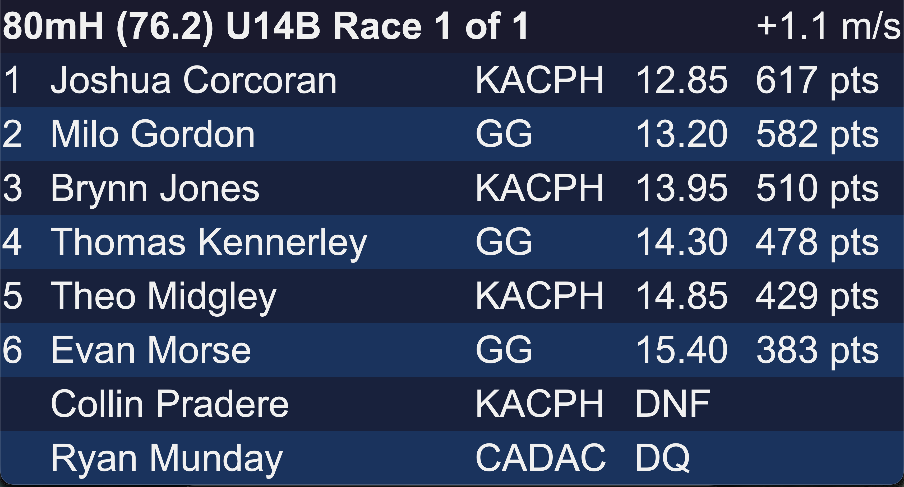
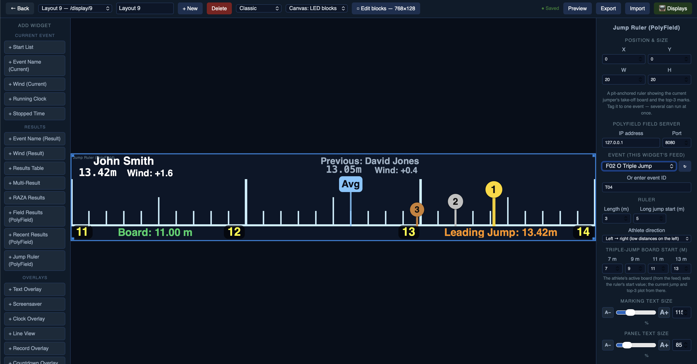
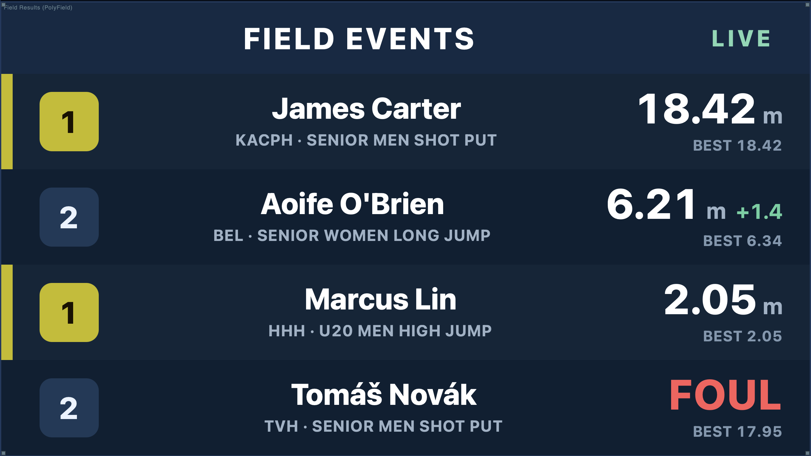
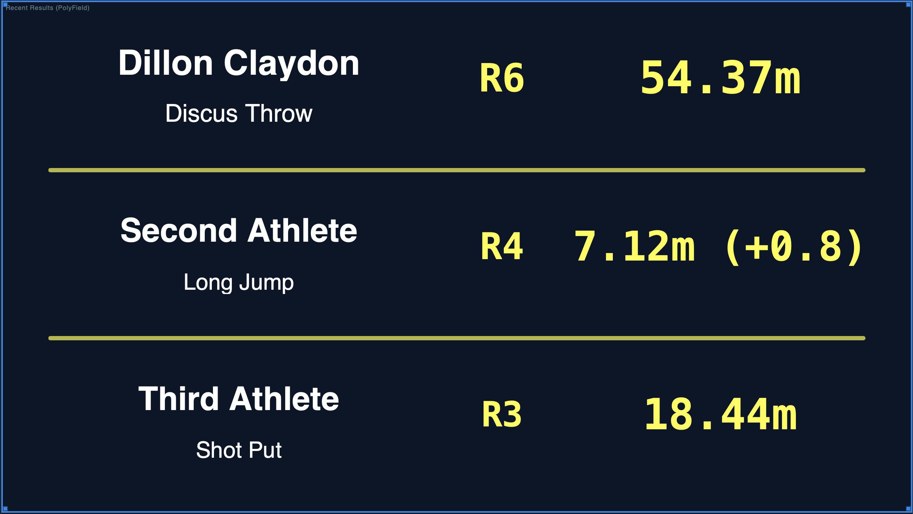
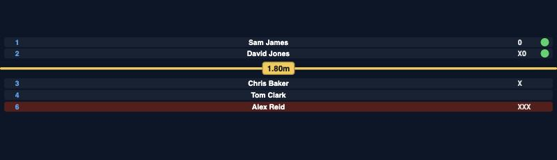
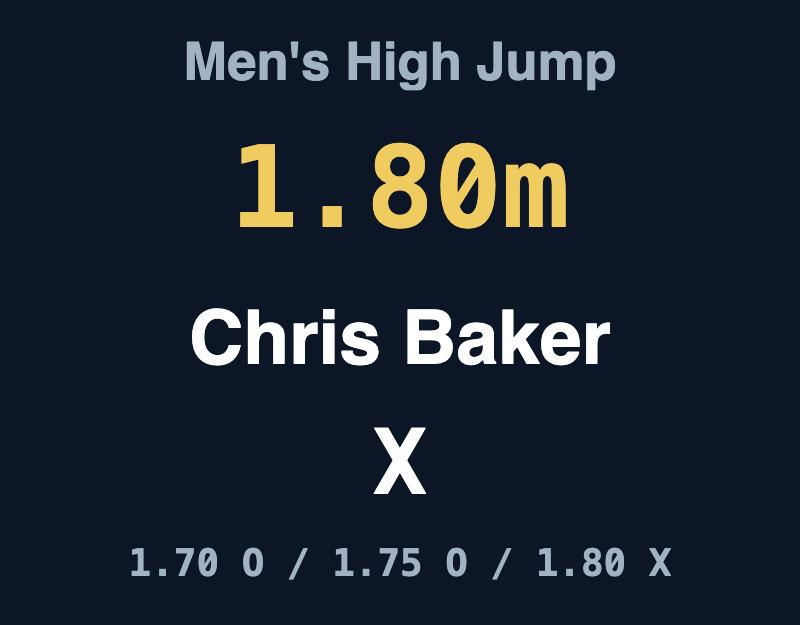
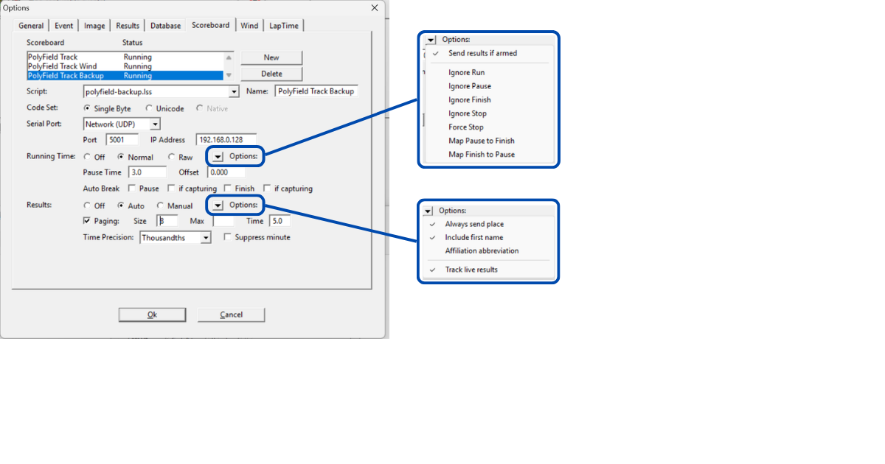

# PolyField Track

Software voor het bekijken en weergeven van resultaten voor de foto-finishsystemen FinishLynx en TimeTronics. Draait op Windows en Mac als een desktoptoepassing die gekoppeld is aan uw map met foto-finishresultaten.

[Downloaden op polyfield.co.uk](https://www.polyfield.co.uk)

* Inhoud
{:toc}

## Overzicht

PolyField Track zet uw FinishLynx- of TimeTronics-resultaten om in live weergaven door uw hele accommodatie. Eén desktopinstantie bewaakt uw resultatenmap en levert een webinterface die elk apparaat op het netwerk kan openen — scoreborden, een zelfbedieningskiosk voor atleten, een snelheidsbord en meer.

De software houdt de **operator aan het roer**: resultaten verschijnen pas nadat ze zijn opgeslagen, wat een positieve validatie vóór weergave waarborgt. Meerdere keren opslaan wordt ondersteund — zo kunt u atleten van langeafstandslopen vroeg tonen, of een race vrijgeven zodra de top 3 prestaties toegewezen heeft gekregen.

## Hoe het werkt

- U draait **één instantie** van de desktoptoepassing op een computer die verbonden is met uw map met foto-finishresultaten.
- De toepassing bouwt een webinterface op **poort 3000**. Elk apparaat op hetzelfde netwerk opent die in een browser — geen installatie nodig op de weergaven.
- Elke weergave registreert zichzelf en kan een lay-out toegewezen krijgen om te tonen. Het aantal weergaven wordt alleen beperkt door uw netwerk en de hostcomputer.
- De operator bepaalt wat er verschijnt — resultaten, overlays (tekst, schermbeveiliging, aftelklok, records, lijnweergave) of een volledige aangepaste lay-out.

## Aan de slag

### 1. De resultatenmap instellen

Dit is de map waarin FinishLynx of TimeTronics resultaten opslaat (LIF, enz.). Klik op de rode knop in de rechterbovenhoek, **«Resultatenmap selecteren»**. U kunt die later wijzigen met **«Map wijzigen»**.

Zodra dit is ingesteld, wordt de webinterface opgebouwd en verschijnt het toegangsadres boven aan de desktoptoepassing (bijv. `http://track.local:3000` of `http://<uw-IP>:3000`).

### 2. Een weergave openen

Open op elk weergaveapparaat een browser en ga naar het getoonde adres, gevolgd door `/display`. Elk scherm dat verbinding maakt, krijgt automatisch een nummer. Zie [Schermen verbinden](#connecting-screens) voor de QR-codesnelkoppeling.

> **Tip** — laat de desktoptoepassing op het startscherm staan en bedien de weergaven vanaf daar, of vanaf een tweede apparaat via de webinterface. Zo houdt u de controle over de overlays terwijl de resultaten automatisch binnenkomen.

## Het desktopbedieningspaneel

Het bedieningspaneel is de werkplek van de operator. Boven aan stelt u de resultatenmap in en ziet u het verbindingsadres. De belangrijkste bedieningen zijn gegroepeerd in een compacte knoppenrij (die op smalle vensters naar een tweede rij springt):

| Bediening | Wat het doet |
|---|---|
| **Tekst & schermbeveiliging** | Typ een bericht om op alle schermen te tonen, of koppel een afbeelding. Ideaal voor sponsorberichten, «bijeenkomst opgeschort», enz. |
| **Schermbeveiliging** | Toon een gekoppelde **afbeelding** of een gekozen **opgeslagen lay-out** over het schermbeveiligingsgebied. Als er al een bron is ingesteld, schakelt één druk die aan/uit; de knop ⚙ heropent de opties. |
| **Lijnweergave** | Stuur de nieuwste foto-finishafbeelding naar de weergaven. Grijs weergegeven totdat er foto-finish-JPG's in de resultatenmap verschijnen. |
| **Klok** | Toon de lopende klok schermvullend op schermen met een klokwidget. |
| **Records** | Toon feestelijke recordkaarten voor atleten die als record zijn gemarkeerd. Vorige / Volgende doorlopen de gemarkeerde atleten of de handmatige selectie. |
| **Aftelklok** | Tel af naar een doeltijdstip. Voer de tijd in en Start; verbergt zichzelf op nul. |
| **Lay-outbouwer** | Open de lay-outontwerper (zie hieronder). |
| **LIF bladeren** | Toon een eerder resultaat uit de bewaakte map opnieuw. |

## Overlays

Overlays zijn dingen die u **bovenop** (of in plaats van) de resultaten toont: tekst, schermbeveiliging, lijnweergave, klok, records en aftelklok. Drie belangrijke punten over hun werking:

- **U kunt er meerdere tegelijk uitvoeren.** Bijvoorbeeld een schermbeveiligingsachtergrond met een aftelklok en een tekstbanner erbovenop. Eén inschakelen schakelt de andere niet meer uit.
- **De widgets bepalen wat waar wordt getoond.** Elke weergave toont alleen de overlays die zijn toegewezen lay-out bevat — zo kunnen verschillende schermen verschillende combinaties tonen vanaf één desktop.
- **Een nieuw resultaat wist ze allemaal** en brengt elk scherm terug naar de resultaten — zodat live resultaten altijd voorrang hebben.

### Schermbeveiliging (afbeelding of lay-out)

Kies **Afbeelding** (een gekoppelde afbeelding — sponsorborden, mededelingen) of **Lay-out** (elke opgeslagen lay-out die als volledige overname van het schermbeveiligingsgebied wordt getoond). Kies de bron en druk op **Weergeven**. Zodra er een bron is ingesteld, schakelt de knop Schermbeveiliging die rechtstreeks in.

### Aftelklok

Telt af naar een **doeltijdstip**, afgelezen van de eigen klok van elk scherm. Voer de tijd in (bijv. 15:40) en Start. In de Lay-outbouwer kunt u het bijschrift instellen (standaard «Next Event In:»), of seconden worden getoond, en de tekst, het lettertype en de kleur. Verbergt zichzelf op nul en wijkt voor nieuwe resultaten en andere overlays.

### Records

Markeer het record van een atleet in FinishLynx (zie [instellen](#finishlynx-setup)), druk dan op **Records** om een feestelijke kaart te tonen — atleet, categorie, onderdeel, club en tijd. Vorige / Volgende doorlopen meerdere gemarkeerde atleten.
Handmatige selectie van een atleet uit een bestaand LIF-bestand en die als record markeren, is ook mogelijk. Druk op **Records** en vervolgens op **Handmatige selectie** om het proces in 3 stappen te starten. 1. Kies de race. 2. Kies de prestatie. 3. Kies of voer het recordtype in.

### Lijnweergave

Stuurt de nieuwste foto-finishafbeelding naar weergaven met een lijnweergavewidget. De bediening Rotatie (s) bepaalt hoe vaak de foto met het resultaat wisselt.

## Tekstgrootte & rotatiemodi

De standaard tekstgrootte van de resultaten wordt aangepast met de knoppen **+** en **−** (lay-outwidgets hebben hun eigen Tekstgrootte in de Lay-outbouwer).

De rotatiemodus bepaalt hoe resultaten met meer dan 8 deelnemers worden weergegeven:

| Modus | Gedrag |
|---|---|
| **Scrollen** | Bovenste 3 rijen vast; rijen 4+ scrollen door de overige deelnemers. |
| **Pagina** | Pagineert: 1–8, dan 9–16, enz. bij rotatie. |
| **Alles scrollen** | Alle 8 rijen scrollen door de deelnemers zonder vaste posities. |

De standaard rotatiesnelheid van atleten is **5 seconden**.

## Bladeren & herstellen

**LIF bladeren** toont eerdere resultaten uit de bewaakte map zodat u er een opnieuw kunt tonen — handig voor fotomomenten of om een eerdere reeks opnieuw weer te geven. Een oud bestand openen in FinishLynx verstoort de live weergave *niet*; alleen een echte wijziging van een resultaat promoot het.

## Schermen verbinden {#connecting-screens}

Open `http://<adres>:3000/display` op elk scherm; het krijgt automatisch een nummer. De pagina **Scherm-QR-codes** (via het paneel Schermen, of `/screens-overview`) toont een scanbare code voor elke weergavepagina, zodat u een telefoon, tablet of tv-browser snel naar de juiste pagina kunt sturen.

In het paneel **Schermen** wijst u aan elk scherm afzonderlijk een opgeslagen lay-out toe en verwijdert u schermen die niet meer actief zijn. De desktop heeft ook een ingebouwde scoreboard-voorbeeldweergave die een echt scherm nabootst zodra u er een lay-out aan toewijst.

## De Lay-outbouwer

Open de Lay-outbouwer om aangepaste scoreborden te ontwerpen met widgets. Elke lay-out heeft een beeldverhouding en een thema, en wordt gebouwd door widgets op een raster te plaatsen en te positioneren.

- **Voeg widgets toe** vanuit het palet aan de linkerkant, gegroepeerd op Huidig onderdeel, Resultaten, Overlays en Informatie.
- **Selecteer een widget** om zijn **Eigenschappen** rechts te bewerken — positie & grootte, kolommen, tekstgrootte, lettertype, kleuren en widgetspecifieke opties.
- **Overlappende widgets:** gebruik de navigator **◀ Widgets ▶** boven aan het paneel Eigenschappen om de selectie door elke widget te doorlopen, ook die verborgen achter andere.
- **Wijs** een lay-out toe aan een scherm (of de scoreboard-voorbeeldweergave) via het paneel Schermen.

## Widgetreferentie

| Widget | Toont |
|---|---|
| Resultatentabel | Het huidige resultaat, met configureerbare kolommen, rotatie en tekstgrootte. |
| Multi-resultaat | Een raster van meerdere resultaten (2×2 / 3×2), nieuwste of roterend. |
| Startlijst | De startlijst voor het huidige onderdeel. |
| Lopende klok / Gestopte tijd | Live of bevroren klok. |
| Onderdeelnaam / Wind | Naam en wind van het huidige onderdeel of resultaat. |
| Aangepaste tekst / Logo / Tijd van de dag | Statische tekst, een afbeelding/logo, of de tijd. |
| RAZA-klassementen | WPA-punten voor para-atletiek. |
| PolyField-veldwidgets (Field Results / Recent Results / Jump Ruler / Vertical Jumps) | Live veldonderdeel-weergaven, gevoed door de PolyField Field-server — gegroepeerd onder **PolyField Server** in het palet. Zie [Weergaven voor horizontale sprongen](#horizontal-jump-displays) en [Weergaven voor verticale sprongen](#vertical-jump-displays) hieronder. |
| Overlays Tekst / Schermbeveiliging / Lijnweergave / Klok | De tekstbanner, schermbeveiligingsafbeelding/-lay-out, foto-finish en schermvullende klok (getoond wanneer de operator de bijbehorende overlay activeert). |
| Record-overlay | Feestelijke recordkaarten (versleepbare elementen, grootte per element). |
| Aftelklok-overlay | Aftellen naar een doeltijd met een bewerkbaar bijschrift. |

## Meerkamppunten

Voor een meerkampwedstrijd kan de resultatentabel een extra kolom **Combined Event** (meerkamp) tonen die elke baanprestatie scoort volgens de officiële **2026 UKA/ESAA-scoretabellen voor meerkamp**.

- **Kolom toevoegen** — selecteer in de Lay-outbouwer een **Resultatentabel**- of **Multi-resultaat**-widget en voeg de kolom **Combined Event** toe (Eigenschappen → Kolommen). Vink **"pts" toevoegen aan de meerkamp-puntenkolom** aan om `617 pts` te tonen in plaats van `617`.
- **Automatisch op onderdeel en geslacht** — de tabel wordt gekozen op basis van de onderdeelnaam (bijv. `80mH (76.2) U14B`), zodat alle leeftijdsgroepen gedekt zijn — U13 t/m U20, Senioren en Masters — zonder instellingen per atleet.
- **Alleen baan** — horden en vlakke lopen worden gescoord; technische onderdelen, estafettes en onderdelen zonder bijpassende tabel blijven leeg.
- **Niet-finishers** — DNS-atleten worden niet getoond; DNF en DQ tonen geen score.

De tijd die voor het opzoeken wordt gebruikt is de weergegeven waarde (al afgerond op de tijdregistratieprecisie), zodat de punten exact overeenkomen met de officiële tabellen.

## Weergaven voor horizontale sprongen {#horizontal-jump-displays}

Deze widgets tonen live veldonderdeelgegevens van een **PolyField Field-server** op hetzelfde netwerk. Voeg ze toe vanuit de groep **PolyField Server** in de Lay-outbouwer; elk heeft een **IP-adres** en **poort** voor de server (standaard `192.168.0.90:8080`).

### Jump Ruler (PolyField)

Een liniaal langs de bak voor **verspringen en hinkstapspringen** — ideaal voor een lange, smalle LED-strip naast de aanloop (bijv. 500 mm × 4–6 m). Hij tekent een afstandsschaal met streepjes per meter / 50 cm / 10 cm, markeert de drie beste sprongen en toont de gegevens van de huidige springer.

- **Koppel hem aan één onderdeel.** Kies het onderdeel in het **Onderdeel**-menu (alleen onderdelen voor *horizontale sprongen* worden vermeld). Meerdere linialen kunnen tegelijk draaien voor verschillende onderdelen, elk apart gekoppeld.
- **Afzetbalk.** De schaal is aan de bak verankerd: voer het **liniaalbegin** in voor verspringen en voor elke hinkstap-balk (**7 / 9 / 11 / 13 m**, met 2 decimalen, bijv. `11.02`). De actieve balk van de atleet (uit de feed) bepaalt welk begin wordt gebruikt, zodat markeringen altijd op de juiste plek vallen.
- **Top-3-pinnen.** De drie beste prestaties verschijnen als pinnen met afnemende hoogte (1e het hoogst, dan 2e en 3e), met de 1e altijd op de voorgrond. Een markering buiten het zichtbare bereik verschijnt als **pijl** aan de rand die de richting aanwijst.
- **Gemiddelde-pin.** Een optionele **Avg**-pin plot het wedstrijdgemiddelde.
- **Atletenpaneel.** Sleep elk onderdeel op zijn plaats — **huidige atleet**, huidige prestatie en wind, **vorige atleet** met prestatie en wind, huidige balk en beste van de wedstrijd — en stel per element het **bijschrift, de kleur, de grootte** en zichtbaarheid in. Plaats ze als banner bovenaan of als zijpaneel.
- **Looprichting.** Kies **links → rechts** of **rechts → links** zodat de schaal overeenkomt met de aanlooprichting van de atleten naar de bak.
- **De flow:** een atleet wordt geselecteerd → getoond als *huidig* (nog geen markering); de sprong wordt gemeten → de *prestatie en wind* verschijnen; de volgende atleet wordt geselecteerd → die wordt *huidig* en de vorige schuift door naar *vorige*.

### Field Results & Recent Results (PolyField)

**Field Results (PolyField)** — een live klassementbord voor veldonderdelen (plaats, atleet, club, onderdeel, prestatie, beste), met de leider gemarkeerd en ongeldige pogingen in het rood.

**Recent Results (PolyField)** — de laatste drie voltooide veldprestaties (naam, onderdeel, ronde en prestatie, met wind voor horizontale sprongen).

## Weergaven voor verticale sprongen {#vertical-jump-displays}

**Vertical Jumps (PolyField)** toont een **hoogspring- of polsstokhoogspringwedstrijd**, gekoppeld aan één onderdeel (alleen *Vertical Jumps*-onderdelen verschijnen in het menu **Onderdeel**). Het staat in de paletgroep **PolyField Server** en heeft twee stijlen.

### Geavanceerd — kwalificatiebord

Een horizontale lat, met de huidige hoogte erop, verdeelt de weergave als een kwalificatiebord.

- Atleten die nog moeten slagen staan **onder** de lat. Wie **slaagt** gaat **boven** de lat met een **groene stip**; een **mislukte** poging toont een **rode stip** en blijft eronder; een **uitgeschakelde** atleet krijgt een **rode rij**.
- Wanneer de **hoogte verandert** verschijnt de lat met een animatie, gaan alle atleten terug onder de lat en vallen de uitgeschakelden weg. Atleten die de hoogte **overslaan** worden niet getoond.
- De verticale positie van de lat volgt de verhouding tussen geslaagd en nog-niet-geslaagd; bij meer atleten dan rijen **roteert** de lijst zodat iedereen wordt getoond.
- De gegevens staan uitgelijnd in kolommen (plaats · naam · pogingen · markering) zodat het netjes blijft ongeacht de lengte van de namen.

### Vereenvoudigd — kaart met huidige stand

Eén kaart met de atleet die nu springt: de huidige hoogte, de naam, de pogingen op die hoogte en de volledige reeks.

Elk onderdeel — onderdeelnaam, hoogte, atleet, pogingen, reeks, en optioneel plaats / beste / startnummer — wordt met **slepen gepositioneerd** met een eigen **bijschrift, kleur, grootte** en zichtbaarheid, net als het paneel van de Jump Ruler.

### Gedeelde opties

- **Geen hoogte ingesteld.** Voordat een hoogte is aangekondigd (het zou `0,00 m` tonen), toont de widget in plaats daarvan de **onderdeelnaam en een sponsorlogo**.
- **Sponsorlogo.** Optioneel — getoond op die wachtkaart en (in de geavanceerde stijl) onder de lat tijdens de hoogtewissel.
- **Configureerbaar** — rijen, tekstgrootte en lettertype, kleuren (lat, geslaagd, mislukt, uitgeschakeld, accent) en de duur van de latanimatie.

## Thema's, startnummers & clubafkortingen

**Thema's** bepalen de standaardkleuren voor alle weergaven; u kunt ze maken, dupliceren en bewerken. **Startnummers** kunnen worden getoond of verborgen in de resultatenweergave. **Clubafkortingen** worden centraal beheerd (bewerk de clublijst) en overal toegepast — voeg een nieuwe club toe of overschrijf een ingebouwde afkorting, en de wijzigingen bereiken alle weergaven binnen enkele seconden.

## Webweergaven

De webweergaven zijn het best toegankelijk via de webinterface, met de toegangsgegevens boven aan de desktoptoepassing. Belangrijke pagina's:

| Pagina | URL |
|---|---|
| Scoreboard (geactiveerde lay-out) | `/scoreboard` |
| Weergavescherm | `/display` |
| Multi-resultaatweergave | `/results` |
| Atletenkiosk | `/athlete` |
| Snelheidsbord | `/speed` |
| Lopende klok | `/clock` |
| RAZA-klassementen | `/raza` |
| Scherm-QR-codes | `/screens-overview` |

### Multi-resultaatweergave

Toont resultaten in een 2×2- of 3×2-matrix. Stel die in om de nieuwste resultaten te tonen of door alle beschikbare resultaten te roteren; pas de tekstgrootte aan; en gebruik de schermvullende modus om de werkbalk te verbergen (elke muisbeweging haalt die terug). Resultaten pagineren, met de huidige pagina boven aan aangegeven. Het zoekpictogram opent de atletenkiosk.

### Atletenkiosk (zelfbediening)

Open `<IP-ADRES>:3000/athlete`. Een atleet zoekt op naam of startnummer; op een naam klikken toont al zijn prestaties in de huidige resultatenmap. Op een resultaatkaart klikken toont die schermvullend voor fotomomenten. **Herstellen** wist de zoekopdracht; de terugknop keert terug naar het zoekveld.

## FinishLynx- & TimeTronics-instellingen {#finishlynx-setup}

- **Scoreboard-scripts** — gebruik de meegeleverde scripts `polyfield.lss`, `polyfield-wind.lss` en `polyfield-backup.lss` zodat FinishLynx de lopende klok, de wind, startlijsten en resultaten naar PolyField Track stuurt. Zie **[Scoreboard-instellingen](#scoreboard-setup)** hieronder voor het configureren van elke uitvoer.
- **Records** — markeer het record van een atleet in het veld **User 3** van FinishLynx (bijv. `PB` of `W50 WR`). Recordcodes worden uitgebreid tot volledige titels op basis van de clublijst.
- **Lijnweergave** — exporteer uw foto-finishafbeeldingen (JPG) naar de bewaakte resultatenmap; de knop Lijnweergave wordt actief zodra ze verschijnen.
- **Resultaten** — sla uw LIF normaal op; PolyField toont alleen opgeslagen resultaten.

### Scoreboard-instellingen (FinishLynx) {#scoreboard-setup}

PolyField Track ontvangt de lopende klok, startlijsten, live resultaten en wind via één UDP-stroom op **poort 5001**. FinishLynx verstuurt deze via zijn **Scoreboard**-uitvoeren (**Options → Scoreboard**). Stel de onderstaande uitvoeren in — elk is een **Netwerk (UDP)**-scoreboard gericht op de computer waarop PolyField Track draait.

**Instellingen die voor elke uitvoer gelden:**

| Instelling | Waarde |
|---|---|
| Serial Port | Network (UDP) |
| Port | `5001` |
| IP Address | het IP-adres van de computer waarop PolyField Track draait |
| Code Set | Single Byte |
| Results | Auto · Paging aan |

#### 1. Hoofduitvoer — `polyfield.lss`

De primaire stroom: lopende klok, startlijsten en live resultaten.

- **Script:** `polyfield.lss` · **Name:** PolyField Track
- **Running Time:** Normal
- **Running Time → Options:** *Send results if armed* ✓
- **Auto Break:** *Finish* ✓ (met *if capturing* ✓)
- **Results → Options:** *Always send place* ✓ · *Include first name* ✓ · *Track live results* ✓ (laat *Affiliation abbreviation* uit — PolyField Track breidt clubnamen uit via zijn eigen clublijst)

#### 2. Winduitvoer — `polyfield-wind.lss`

Een aparte uitvoer voor windmetingen.

- **Script:** `polyfield-wind.lss` · **Name:** PolyField Track Wind
- **Running Time:** **Raw** — de wind vuurt bij elke celonderbreking; de Raw-modus geeft elke meting ongewijzigd door (PolyField Track negeert de «no data»-waarden)
- **Running Time → Options:** *Send results if armed* uit
- **Results → Options:** *Always send place* ✓ · *Include first name* ✓ · *Affiliation abbreviation* ✓ · *Track live results* ✓

#### 3. Back-upuitvoer — `polyfield-backup.lss` (aanbevolen)

Een tweede, onafhankelijke kopie van de **startlijst** voor betrouwbaarheid. FinishLynx verstuurt elke startlijst maar één keer wanneer het onderdeel wordt geladen, dus één verloren UDP-pakket kan een scherm leeg laten. Deze back-upuitvoer verstuurt een identieke startlijst vanaf een apart scoreboard: als één pakket verloren gaat, komt het andere alsnog aan. Richt deze op **dezelfde** PolyField Track-computer.

- **Script:** `polyfield-backup.lss` · **Name:** PolyField Track Backup
- **Running Time:** Normal
- **Running Time → Options:** *Send results if armed* ✓
- **Results → Options:** *Always send place* ✓ · *Include first name* ✓ · *Track live results* ✓

> Alle drie de uitvoeren kunnen tegelijk draaien en naar hetzelfde IP en dezelfde poort sturen — PolyField Track onderscheidt ze op inhoud.

## Netwerk

- De toepassing draait op **poort 3000** en kondigt zichzelf aan als `track.local` op het netwerk, zodat weergaven `http://track.local:3000` kunnen gebruiken zonder het IP te kennen.
- Kies op computers met meer dan één netwerkkaart (gebruikelijk op Windows) de juiste netwerkadapter in het verbindingspaneel, zodat het juiste adres wordt aangekondigd.
- Alle apparaten moeten op hetzelfde netwerk zitten als de hostcomputer.

## Problemen oplossen

| Symptoom | Controleren |
|---|---|
| De knop Lijnweergave is grijs | Nog geen foto-finish-JPG's in de bewaakte map — controleer het exportpad voor afbeeldingen in FinishLynx. |
| Records toont niets | De atleet moet gemarkeerd zijn in FinishLynx User 3 of via handmatige selectie, en de lay-out moet een Record-overlaywidget bevatten. |
| Een weergave toont «wachten op lay-out» | Wijs een lay-out toe aan dat scherm in het paneel Schermen. |
| Een oud resultaat verscheen opnieuw | Een bestand openen in FinishLynx promoot het niet meer; alleen een echte wijziging doet dat. Gebruik LIF bladeren om eerdere resultaten bewust opnieuw te tonen. |
| Weergaven kunnen geen verbinding maken | Bevestig hetzelfde netwerk, poort 3000 bereikbaar en (pc's met meerdere kaarten) de juiste netwerkadapter geselecteerd. |

## Downloaden & ondersteuning

Download de nieuwste versie op [www.polyfield.co.uk](https://www.polyfield.co.uk) of via de [releases-pagina](https://github.com/KingstonPolyAC/PolyField-Track/releases). Ondersteuning: [support@polyfield.co.uk](mailto:support@polyfield.co.uk).
